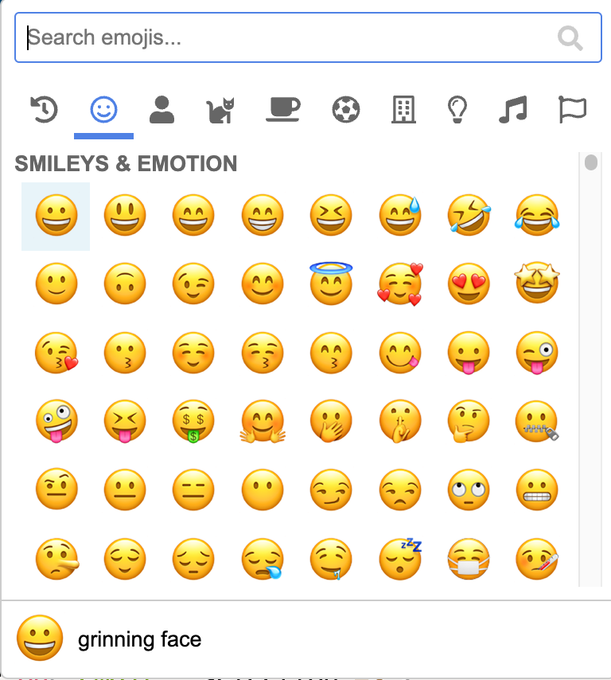

I am excited to launch this new website for PicMo, which will have a final release very soon.

## A brief history

PicMo began in 2019 as an experiment to see what could be done using plain JavaScript. Its original name was Emoji Button, and has had two previous package names on npm:

- [emoji-button](https://www.npmjs.com/package/emoji-button): The original package name which it kept up until the 2.2.2 release.
- [@joeattardi-emoji-button](https://www.npmjs.com/package/@joeattardi-emoji-button): In order to publish a package on [GitHub Package Registry](https://github.com/features/packages), the package name must be scoped. To comply with this requirement, the package name was changed to `@joeattardi/emoji-button`, a name that doesn't exactly roll off the keyboard!

With the major rewrites and updates, I thought it was time for a new name. 

As is often done these days, I [took to Twitter for advice](https://twitter.com/JoeAttardi/status/1504536333091581960).

After receiving many suggestions and doing some brainstorming on names of my own I decided I really liked PicMo. It's short for "pick emoji", which was my original pick for the name, but [someone beat me to it](https://www.npmjs.com/package/pick-emoji).

So, PicMo it is!

The past year has seen lots of growth for this library, based on npm statistics:

- 4/19/21: 4,402 weekly downloads
- 7/20/21: 10,553 weekly downloads
- 1/4/22: 15,400 weekly downloads
- 4/11/22: 39,277 weekly downloads

## What's changed?

The overall look of the picker hasn't changed much:

| Emoji Button 4.6 | PicMo 5 |
|----|----|
|  |  |

This was a major refactoring. Much of the changes are internal, but here are a few of the major external changes.

### UMD is back!

The current 4.x release of Emoji Button is distributed as an ES Module only. I have received feedback several times that this has made things a bit difficult for some projects, so starting with version 5, PicMo will also include a UMD build that can be retrieved from a CDN.

### Emoji data change

Prior to PicMo 5, the emoji data was generated with a script and bundled with the package, which is the reason for its [rather large bundle size](https://bundlephobia.com/package/@joeattardi/emoji-button@4.6.4). This home-grown data file has been scrapped, and instead the emoji data now comes from the [Emojibase](https://emojibase.dev/) project. The emoji data can be supplied in two ways:

- **Automatically downloaded from a CDN**. This greatly cuts down on the deployed bundle size.
- **Provided with the bundle**. The data is installed separately with the [emojibase-data](https://www.npmjs.com/package/emojibase-data) and passed to the picker

The emoji data is then cached locally in an IndexedDB database in the browser.

Using Emojibase also provides the emoji data localized in many different languages.

Emojibase also provides keywords/tags for each emoji. When searching for emojis, matching tags are included in the search results.

### New renderer architecture

Like prior versions, PicMo 5 supports rendering the native emojis provided by the operating system or with the cross-platform [Twemoji](https://twemoji.twitter.com/) library. This rendering has been reworked to provide greater flexibility.

The Twemoji renderer is a separate export from the package. If you only use native emojis, this means you won't needlessly have the Twemoji library in your bundle as well.

This design also opens the door for other renderers in the future, as all renderers follow a well-defined API.

### Inline or popup

PicMo 5 provides a popup picker triggered by a button as before, but now also supports an inline picker which can be used as part of a larger popup/modal or just right in the page.

### Plugins removed, for now

The plugin system was very limited and was not really being widely used. I have some further ideas for plugins, but this will need to wait for a future release.

## More to come soon

It has been a long road to get to this point and I am in the home stretch now, focusing on testing and documentation. The documentation is still a work in progress but the latest can be seen [on this site](/docs/getting-started/overview).

You can try out a beta version of the package, which is now published under the [picmo](https://www.npmjs.com/package/picmo) package name.

If you run into issues with the beta I would greatly appreciate feedback! Feel free to please file [GitHub issues](https://github.com/joeattardi/picmo/issues) - just make sure to specify that you are using the beta of PicMo and not Emoji Button 4.x.

Upon final release of PicMo 5, a full changelog will be made available as well as a migration guide.

## Get in touch!

Thanks for reading! If you are using Emoji Button/PicMo in a project, please let me know! I would love to compile a page listing cool projects using the library.
